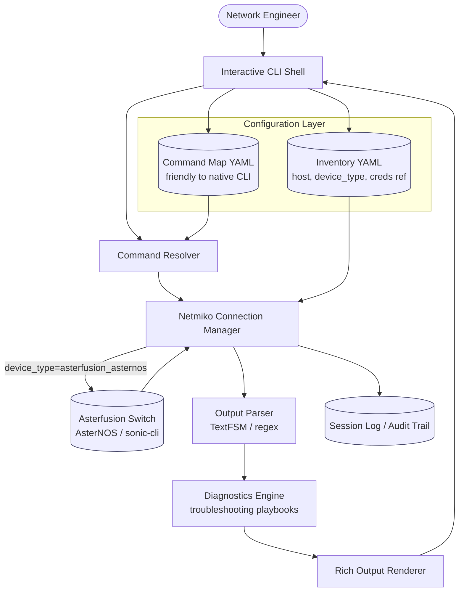
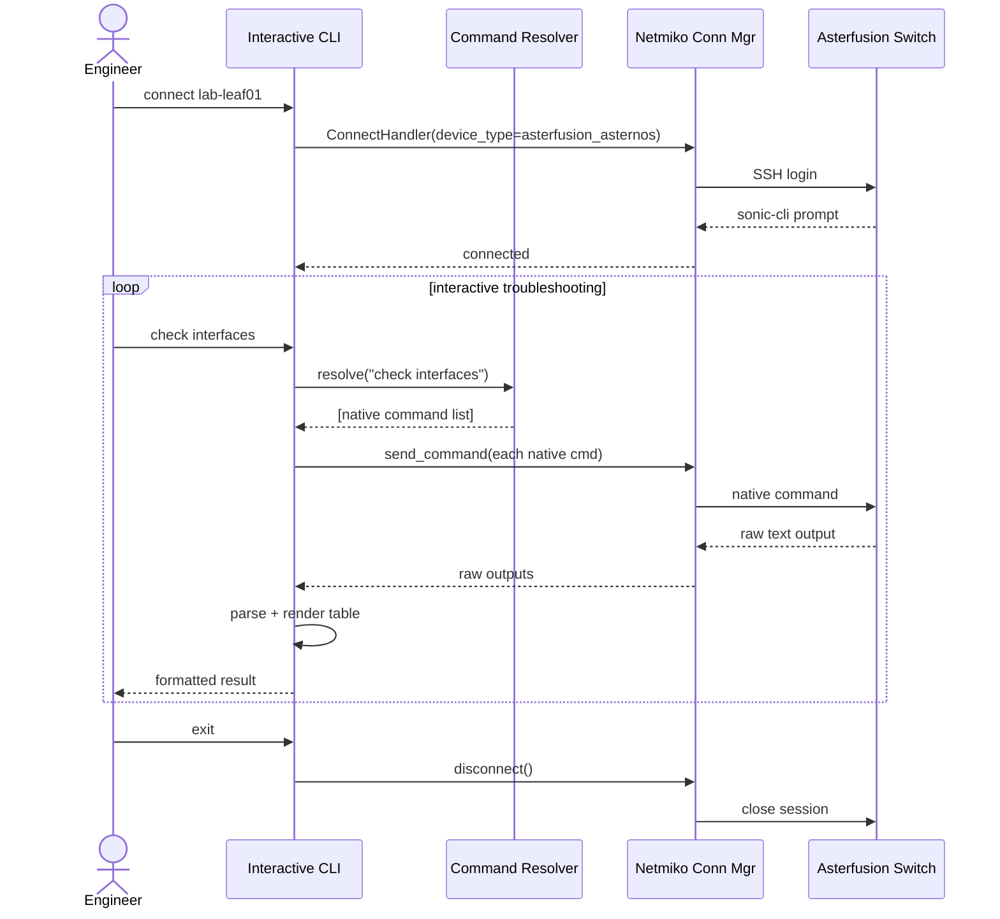

# Asterfusion Troubleshooting CLI — Design Plan

**Status:** Draft
**Owner:**
**Date:** 2026-08-21

---

## 1. Problem Statement

Troubleshooting Asterfusion (AsterNOS / SONiC, Klish `sonic-cli`) switches today means SSHing in and remembering
native CLI syntax per task. The goal is a Python interactive CLI that:

- Connects via **Netmiko** using the native `device_type="asterfusion_asternos"` driver.
- Lets the operator type **friendly, task-oriented commands** ("check interfaces", "check bgp") instead of raw
  `sonic-cli` syntax.
- Translates those into one or more native commands, runs them, parses the output, and renders a clean result.

## 2. Scope

**In scope:** single or multi-switch interactive troubleshooting session, read-oriented commands (show/diagnostics),
command abstraction layer, structured output, session logging.

**Out of scope (for v1):** pushing config changes, multi-user RBAC, GUI/web front end, real-time streaming telemetry.

---

## 3. Architecture



### Component breakdown

| Component | Responsibility | Suggested tech |
|---|---|---|
| Interactive CLI Shell | Prompt, tab-completion, history, help text | `cmd2` or `prompt_toolkit` |
| Inventory | Switch hosts, ports, device_type, credential *reference* (not plaintext) | YAML/JSON + env vars or a secrets manager |
| Command Map | Friendly verb → one or more native `sonic-cli` commands | YAML/JSON, hot-reloadable |
| Command Resolver | Looks up the friendly command, validates args, expands to native command list | Python module |
| Connection Manager | Wraps `netmiko.ConnectHandler`, connection reuse, reconnect/retry | Netmiko (`asterfusion_asternos`) |
| Output Parser | Converts raw CLI text into structured data | TextFSM/`ntc-templates` if available, else regex |
| Diagnostics Engine | Runs multi-command "playbooks" and flags issues (e.g. interface down + error counters rising) | Python |
| Output Renderer | Tables/color output back to the shell | `rich` |
| Session Log | Every command + output, per device, for audit | Netmiko `session_log` + your own log file |

---

## 4. Interactive Session Flow



---

## 5. Command Abstraction Map (example — verify exact syntax against docs.asternos.com or `?`/Tab on your build)

| Friendly command | Native `sonic-cli` command(s) |
|---|---|
| `show interfaces` | `show interface status` |
| `show interface errors <if>` | `show interface counters errors` |
| `check bgp` | `show ip bgp summary` |
| `check vlan` | `show vlan brief` |
| `show logs` | `show logging` |
| `config mode` (internal, not user-facing) | `configure terminal` |

This table is meant to become the seed for `command_map.yaml` — keep it data-driven so adding a new troubleshooting
shortcut never requires a code change.

```yaml
# command_map.yaml (sketch)
show_interfaces:
  native: ["show interface status"]
  parse: textfsm:sonic_show_interface_status.textfsm

check_bgp:
  native: ["show ip bgp summary"]
  parse: textfsm:sonic_show_ip_bgp_summary.textfsm
```

---

## 6. Error Handling & Edge Cases

- Auth failure → `NetmikoAuthenticationException`, surface a clear message, don't retry with same creds.
- Timeout / unreachable → `NetmikoTimeoutException`, offer retry/skip when looping over multiple switches.
- Unmapped friendly command → fall back to "pass-through" mode (send raw command as typed) with a warning, rather
  than hard failure.
- Prompt/paging issues (`--More--`) → confirm Netmiko's asterfusion driver handles paging; disable paging via
  `terminal length 0`-equivalent if needed, test against a real device early.

## 7. Security Considerations

- No plaintext passwords in the inventory file — reference env vars, `getpass`, or a vault/secrets manager.
- Session logs may contain sensitive output (routes, configs) — store with restricted permissions, consider
  redaction for shared logs.
- If this ever grows multi-user, add per-user auth and command allow-lists (RBAC is explicitly out of scope for v1).

## 8. Testing Plan

- Unit-test the Command Resolver and Output Parser against captured sample outputs (no live switch needed).
- Mock `netmiko.ConnectHandler` for CLI-shell-level tests.
- Integration test against a lab AsterNOS switch for the full connect → command → parse round trip.

## 9. Open Questions

- Single switch per session, or should the shell support "connect to N switches, run this on all"?
- Preferred shell framework — `cmd2` (batteries-included, argparse-based subcommands) vs `prompt_toolkit`
  (more control, nicer async support)?
- Where do parsed/structured results go besides the terminal — just display, or also exportable (JSON/CSV) for
  tickets/reports?

---

## 10. Project File Structure

Uses a **src-layout Python package** so the installable package, tests, config, and docs stay cleanly separated.
Each top-level module under `asterfusion_cli/` maps 1:1 to a component in the architecture diagram (§3) for easy
traceability.

```
asterfusion-cli/
├── pyproject.toml              # packaging + console_script entry point
├── README.md
├── .gitignore
├── .env.example                # documents required env vars, no real secrets
│
├── config/
│   ├── inventory.yaml.example  # switches: host, device_type, creds *reference*
│   └── command_map.yaml        # friendly -> native command mappings (data, not code)
│
├── src/
│   └── asterfusion_cli/
│       ├── __main__.py         # `python -m asterfusion_cli` entry point
│       │
│       ├── cli/                # -- Interactive Shell Layer --
│       │   ├── shell.py        # cmd2/prompt_toolkit shell loop
│       │   └── commands/       # one file per user-facing verb
│       │       ├── connect.py
│       │       ├── show.py
│       │       └── check.py
│       │
│       ├── config/             # -- Configuration Layer --
│       │   ├── inventory.py    # load/validate inventory.yaml
│       │   ├── command_map.py  # load/validate command_map.yaml
│       │   └── settings.py     # env var + secrets resolution
│       │
│       ├── connection/         # -- Connection Manager --
│       │   ├── manager.py      # wraps netmiko.ConnectHandler
│       │   └── exceptions.py   # app-level exceptions wrapping Netmiko's
│       │
│       ├── resolver/           # -- Command Resolver --
│       │   └── resolver.py     # friendly command -> native command(s)
│       │
│       ├── parsing/            # -- Output Parser --
│       │   ├── parser.py       # dispatches to the right template
│       │   └── templates/      # *.textfsm files, one per command
│       │
│       ├── diagnostics/        # -- Diagnostics Engine --
│       │   ├── engine.py       # runs a playbook, collects findings
│       │   └── playbooks/      # one file per troubleshooting playbook
│       │       ├── interface_health.py
│       │       └── bgp_health.py
│       │
│       ├── rendering/          # -- Output Renderer --
│       │   └── renderer.py     # rich tables/color output
│       │
│       └── logging/            # -- Session Log / Audit --
│           └── session_log.py
│
├── tests/
│   ├── unit/                   # mirrors src/ structure 1:1, no live switch needed
│   │   ├── test_resolver.py
│   │   ├── test_parser.py
│   │   └── test_diagnostics.py
│   ├── integration/            # needs a real/lab switch, marked + skipped in normal CI
│   │   └── test_live_switch.py
│   └── fixtures/
│       └── raw_outputs/        # captured raw CLI text for parser tests
│           └── show_interface_status.txt
│
├── docs/
│   └── asterfusion-cli-plan.md # this design doc
└── scripts/
    └── dev_setup.sh
```

### Principles applied

| Principle | How it shows up here |
|---|---|
| Separation of concerns / layered architecture | Each package under `asterfusion_cli/` = one box in the §3 diagram |
| Single Responsibility Principle | `manager.py` only connects/sends; `renderer.py` only formats — never both |
| Dependency inversion / testability | `resolver/` and `diagnostics/` depend on the connection manager's interface, not Netmiko directly, so they're mockable in `tests/unit` |
| Open/Closed Principle | `diagnostics/playbooks/` and `parsing/templates/` are plugin directories — new checks are new files, not edits to `engine.py` |
| Externalized configuration (12-factor) | `command_map.yaml` / `inventory.yaml` are data; secrets live in env vars, never in the repo |
| src-layout packaging | Forces `pip install -e .`, mirroring production import behavior instead of relying on CWD |

---

## Reusable template (strip the content above, keep this skeleton for future automation projects)

1. Problem Statement
2. Scope (in / out)
3. Architecture (diagram)
4. Component breakdown (table)
5. Key flow(s) (sequence diagram)
6. Data/command mapping (table)
7. Error handling & edge cases
8. Security considerations
9. Testing plan
10. Open questions