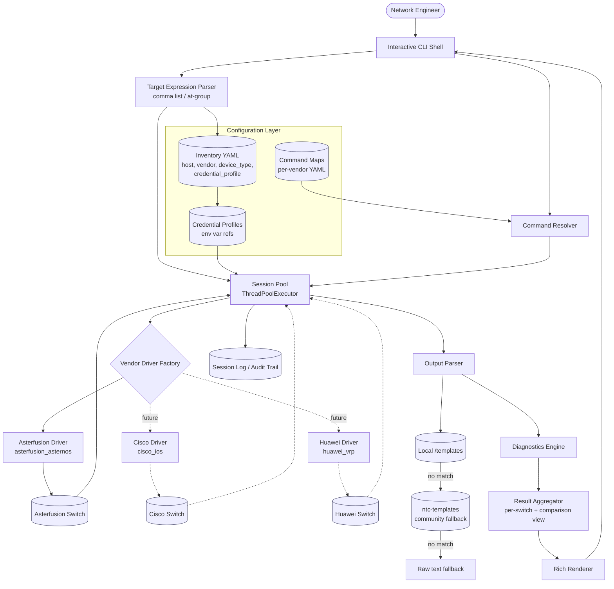
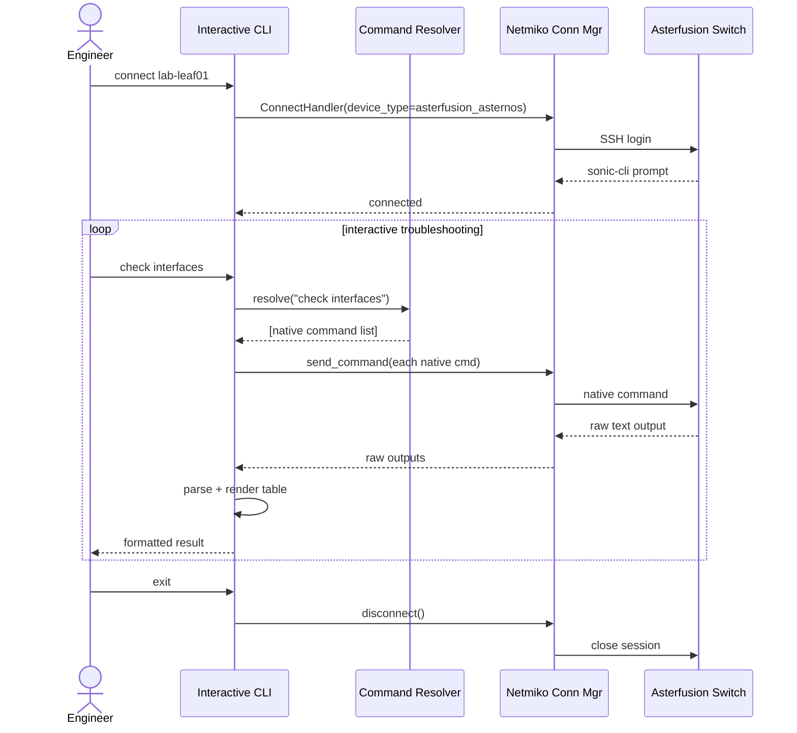
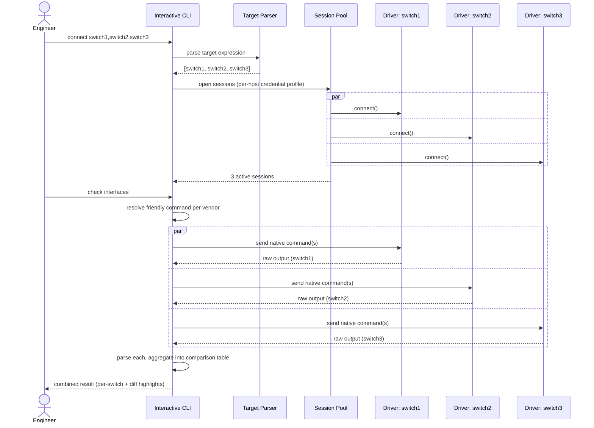
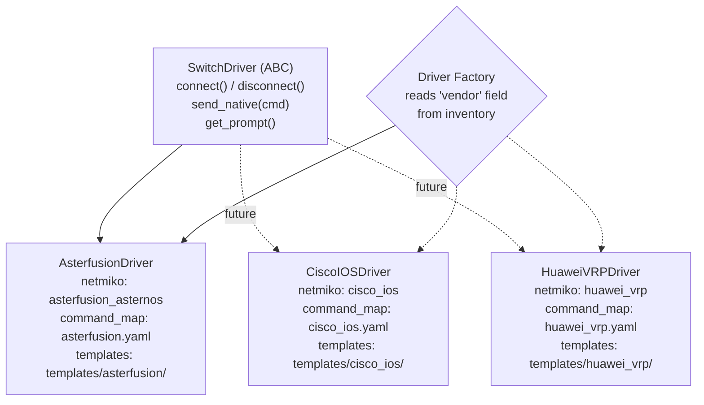
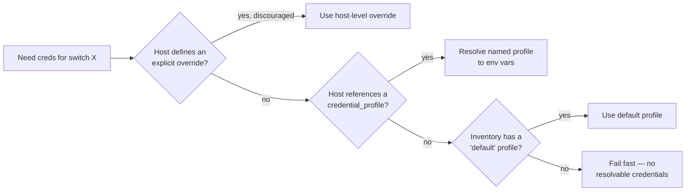
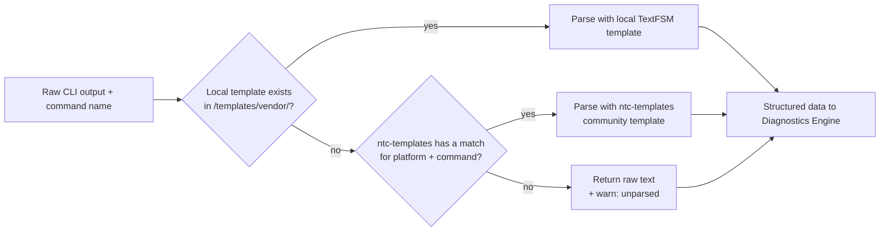

# Asterfusion Troubleshooting CLI — Design Plan

**Status:** Draft (v2 — multi-switch, multi-vendor architecture)
**Owner:** hakeem <joshuakim408@gmail.com>
**Date:** 2026-08-22

---

## 1. Problem Statement

Troubleshooting Asterfusion (AsterNOS / SONiC, Klish `sonic-cli`) switches today means SSHing in and remembering
native CLI syntax per task. The goal is a Python interactive CLI that:

- Connects via **Netmiko** using the native `device_type="asterfusion_asternos"` driver.
- Lets the operator type **friendly, task-oriented commands** ("check interfaces", "check bgp") instead of raw
  `sonic-cli` syntax.
- Translates those into one or more native commands, runs them, parses the output, and renders a clean result.
- Can target **one or many switches at once**, and is architected so **other vendors (Cisco, Huawei, ...)** can be
  added later without reworking the core.

## 2. Scope

**In scope:** single or multi-switch interactive troubleshooting session, read-oriented commands (show/diagnostics),
command abstraction layer, structured output, session logging, multi-vendor extensibility, heterogeneous credentials.

**Out of scope (for v1):** pushing config changes, multi-user RBAC, GUI/web front end, real-time streaming telemetry.

---

## 3. Architecture



### Component breakdown

| Component | Responsibility | Suggested tech |
|---|---|---|
| Interactive CLI Shell | Prompt, tab-completion, history, help text | `cmd2` or `prompt_toolkit` |
| Target Expression Parser | Parses `connect <expr>` into a concrete list of inventory hosts | Python module (see §5) |
| Inventory | Switch hosts, vendor, device_type, credential *profile reference* | YAML/JSON |
| Credential Profiles | Named credential bundles, resolved via env vars | YAML/JSON + env vars or a vault |
| Command Map | Friendly verb → native command(s), **per vendor** | YAML/JSON, hot-reloadable |
| Command Resolver | Looks up friendly command for a given vendor, expands to native command list | Python module |
| Session Pool | Holds one live connection per targeted switch, fans out commands concurrently | `concurrent.futures.ThreadPoolExecutor` + Netmiko |
| Vendor Driver Factory | Picks the right driver class per switch's `vendor` field | Factory + Strategy pattern (see §7) |
| Output Parser | Converts raw CLI text into structured data, with a fallback chain | TextFSM: local → `ntc-templates` → raw (see §10) |
| Diagnostics Engine | Runs multi-command "playbooks" and flags issues | Python |
| Result Aggregator | Merges per-switch results into a single comparable view | Python |
| Output Renderer | Tables/color output back to the shell | `rich` |
| Session Log | Every command + output, per device, for audit | Netmiko `session_log` + your own log file |

---

## 4. Single-Target Interactive Session Flow



---

## 5. Multi-Switch Targeting Syntax

### Research: how existing tools solve "run this on several hosts"

| Tool | Syntax | Notes |
|---|---|---|
| Ansible ad-hoc / `--limit` | `webservers:dbservers` (OR), `webservers:&prod` (AND), `webservers:!staging` (NOT); comma is also accepted as a separator | Operators live **inside one quoted pattern string**, never as bare top-level shell tokens |
| ClusterShell `clush -w` | `node[1-5,7,9-11]` (bracket range expansion), `@group` (named node groups), `@Agroup&@Bgroup` (set intersection) | Same principle — `&` appears inside the NodeSet pattern argument, not between two separate commands |
| `pssh`/`pdsh` | Comma-separated host list, or `-h hosts.txt` | Simplest possible convention, no operators at all |

### Why not reuse bash's `&` / `|` as top-level separators

Technically, since `aster-cli` is its own REPL (reading a full line via `cmd2`/`prompt_toolkit`), the OS shell never
sees these characters — there's no risk of bash intercepting them before they reach the app. The real risk is **two
collisions with what operators already expect**:

1. **Mental model collision.** To anyone who's used a Linux shell, `&` means "background this job" and `|` means
   "pipe this command's output into the next command." Reusing them here to mean "these are separate hosts" fights
   existing muscle memory instead of leveraging it.
2. **A better, more expected use for `|` is being given up.** Every real network CLI — Cisco IOS, Junos, Arista EOS,
   and `sonic-cli` itself — supports `<command> | include <pattern>` for output filtering. That's a feature
   operators will actively reach for in a troubleshooting tool (`check interfaces | include down`). If `|` already
   means "multiple targets," that feature becomes ambiguous or impossible later.

### Recommendation

Follow the pattern every tool above converges on for the simple case, and reserve room to grow:

```
connect <target-list>
target-list := target ("," target)*                  # union (OR)
target      := <hostname>
             | "@" <group-name>                       # explicit curated group, e.g. @core_uplinks
             | "@" <dimension> ":" <value>             # attribute filter, e.g. @site:nairobi
             | target "&" target                       # intersection (AND), no spaces — see note below
```

- **v1:** comma-separated explicit host list — `connect switch1,switch2,switch3`. Zero ambiguity, trivial to parse,
  matches `pssh`/Ansible's comma convention.
- **v1 (promoted from "near-term" once inventory grouping landed, see §8):** attribute filters and named groups —
  `connect @site:nairobi`, `connect @role:leaf`, `connect @core_uplinks`.
- **v1, narrowly scoped:** intersection between two `@`-prefixed filters — `connect @role:leaf&@site:nairobi`
  ("leaf switches in Nairobi"). This mirrors Ansible's `webservers:&production` idiom exactly: the operator sits
  tight between two group expressions with no surrounding spaces, which is visually and semantically distinct from
  bash's spaced `cmd1 & cmd2 &` job-control idiom — the collision flagged above was specifically about reusing `&`
  as a loose separator between whole commands, not this tighter, well-precedented "intersect two sets" shape. Once
  switches carry site/role/environment tags (§8), this stops being a "nice to have" — "prod leaf switches in
  Nairobi" is a genuinely common troubleshooting query, so it's worth having from the start rather than deferring.
- **Later, if the fleet grows large:** ClusterShell-style bracket ranges — `connect leaf[01-04]` — for sequentially
  named switches. Still deferred (YAGNI); add only once a real fleet makes typing full lists painful.
- **Still explicitly deferred:** exclusion (`@role:leaf!@site:mombasa`) and more than one intersection in a single
  expression. Two-term intersection covers the realistic v1 cases; add more algebra only when a real query needs it.
- **Reserved, not reused:** `|` stays free for future output filtering (`show interfaces | include down`), matching
  what a network engineer already expects from a CLI like this.

`connect <target-expr>` sets the **active session set** for the shell. A lightweight per-command scope override
(e.g. `on switch2: show interfaces`) is worth adding once the fan-out model (§6) is in place, so a single switch can
be queried without dropping the rest of the active set.

---

## 6. Multi-Switch Command Fan-Out & Aggregation

Netmiko itself is synchronous/blocking per connection, so fan-out means running N connections concurrently and
collecting results — the same execution model tools like Nornir already implement (see the build-vs-adopt note
below).



**Design notes:**

- Use `concurrent.futures.ThreadPoolExecutor` (one worker per active session) — Netmiko connections are I/O-bound
  and thread-safe per-instance, so this is enough concurrency without the complexity of asyncio.
- A failure on one switch (timeout, auth) must not abort the others — collect `(switch, result | error)` pairs and
  report partial success clearly, rather than failing the whole fan-out.
- Aggregation has two useful shapes: **per-switch tables** (full detail) and a **comparison view** (one row per
  field, one column per switch) — the comparison view is what makes "switch3's interface is the only one down"
  jump out visually.
- **Build-vs-adopt call-out:** this connection-pool + fan-out + result-aggregation pattern is exactly what
  **Nornir** (with the `nornir-netmiko` plugin) already implements, along with an inventory model that natively
  supports grouups, defaults, and multi-vendor plugins. Hand-rolling it (as sketched here) gives more control and a
  smaller dependency footprint; adopting Nornir gives you a battle-tested engine at the cost of designing the CLI
  as a thin layer on top of Nornir's conventions instead of your own. Worth a deliberate decision rather than
  drifting into either one.

---

## 7. Multi-Vendor Driver Abstraction

To support Cisco, Huawei, etc. later without reworking the core, every vendor sits behind the same interface —
the Strategy/Adapter pattern (the same idea NAPALM uses to give Cisco/Juniper/Arista/Huawei a common API, though
our abstraction is command-oriented rather than fixed-getter-oriented).



**Design notes:**

- `SwitchDriver` is an abstract base class (or `typing.Protocol`) defining the minimal contract the rest of the
  app relies on. The Session Pool, Resolver, and Diagnostics Engine only ever talk to this interface — they never
  import Netmiko or know which vendor they're talking to (Liskov substitution: any driver is interchangeable).
- Each concrete driver owns three things: its Netmiko `device_type`, its slice of the command map, and its
  templates directory. Adding Cisco support later means adding `drivers/cisco_ios.py` +
  `config/command_map/cisco_ios.yaml` + `parsing/templates/cisco_ios/` — no existing file changes (Open/Closed
  Principle, same as the playbooks directory in §10 of the file structure).
- The Driver Factory is a simple registry (`{"asterfusion": AsterfusionDriver, "cisco_ios": CiscoIOSDriver, ...}`)
  keyed off each inventory entry's `vendor` field — plain dictionary dispatch is enough; no need for
  plugin-discovery machinery until there's a real reason to load drivers from outside the codebase.

---

## 8. Credential Resolution Model

Switches won't all share one login. Model this the same way Ansible's `group_vars`/`host_vars` and Nornir's
inventory layering do: **named credential profiles**, referenced by each host, with a fallback default.



### Grouping switches: site / role / environment

Site, role, and environment are **orthogonal** dimensions — a switch is simultaneously in one site, one role, and
one environment, and none of those contains the other. That rules out a single nested tree of groups (Ansible's
classic `[group] -> hosts` model starts fighting you the moment a host needs to belong to independent categories
at once). Two complementary mechanisms cover this instead, the same combination Ansible and Nornir both end up
using for the same reason:

1. **Attribute tags on each switch** (`site`, `role`, `environment`) — the source of truth, one line each, no
   duplication. These are what `@site:nairobi` / `@role:leaf` (§5) filter on directly.
2. **An optional `groups:` block** for hand-curated sets that don't correspond to a single attribute — e.g. a
   maintenance window's switch list, or "core_uplinks" spanning multiple roles. Referenced as `@core_uplinks`.

```yaml
# inventory.yaml (sketch)
credential_profiles:
  default:
    username_env: ASTER_DEFAULT_USER
    password_env: ASTER_DEFAULT_PASS
  leaf_admin:
    username_env: LEAF_ADMIN_USER
    password_env: LEAF_ADMIN_PASS

groups:                        # optional, hand-curated, many-to-many, independent of site/role/environment
  core_uplinks:
    - switch1
    - switch4

switches:
  switch1:
    host: 10.0.0.11
    vendor: asterfusion
    device_type: asterfusion_asternos
    credential_profile: default
    site: nairobi
    role: spine
    environment: prod
  switch2:
    host: 10.0.0.12
    vendor: asterfusion
    device_type: asterfusion_asternos
    credential_profile: default
    site: nairobi
    role: leaf
    environment: prod
  switch3:
    host: 10.0.0.13
    vendor: asterfusion
    device_type: asterfusion_asternos
    credential_profile: leaf_admin   # different login than switch1/switch2
    site: mombasa
    role: leaf
    environment: staging
```

- Precedence: host-level explicit override (rare, flagged in code review) → host's named `credential_profile` →
  inventory-wide `default` profile → fail fast with a clear "no credentials resolvable for host X" error rather
  than silently skipping.
- Never store actual secrets in `inventory.yaml` — only the *names* of env vars (or vault keys). This is what lets
  `switch1`/`switch2` share `default` while `switch3` uses `leaf_admin`, without any plaintext passwords in
  version control.
- **Deliberate v1 scope decision:** `site`/`role`/`environment` are targeting tags only — they do **not** cascade
  default `credential_profile` or other settings the way Ansible `group_vars` would (e.g. "all Mombasa switches
  default to `leaf_admin` unless overridden"). Adding that means picking a precedence order across three
  orthogonal dimensions, which is real design work with no clear "correct" answer yet — see the open question
  below. Every switch stays explicit about its own `credential_profile` for now.

---

## 9. Command Abstraction Map (per vendor)

Command maps are now namespaced by vendor, so the Resolver looks up `(vendor, friendly_command)`:

| Friendly command | Native `sonic-cli` command(s) — Asterfusion |
|---|---|
| `show interfaces` | `show interface status` |
| `show interface errors <if>` | `show interface counters errors` |
| `check bgp` | `show ip bgp summary` |
| `check vlan` | `show vlan brief` |
| `show logs` | `show logging` |

*(Verify exact syntax against docs.asternos.com or `?`/Tab-completion on your build.)*

```yaml
# config/command_map/asterfusion.yaml (sketch — see the real file for the full version)
show_interfaces:
  native: ["show interface status"]
  parse: ntc          # "ntc" = delegate to Netmiko's use_textfsm=True (ntc-templates), for now

check_bgp:
  native: ["show ip bgp summary"]
  parse: ntc
```

`parse` takes either `ntc` (delegate to ntc-templates via Netmiko, current default — see §10) or a local path once
one exists (`templates/asterfusion/show_interface_status.textfsm`), which always wins over `ntc` per the fallback
chain. **Caveat:** ntc-templates' public index currently has no `asterfusion_asternos` (or generic `sonic`)
platform, so today these all resolve to raw text — this is a deliberate, forward-compatible placeholder, not a bug.

Each future vendor gets its own file (`config/command_map/cisco_ios.yaml`, etc.) with the *same friendly command
names* mapped to that vendor's native syntax — the whole point is that `check bgp` means the same thing to the
operator regardless of which switch answers it.

---

## 10. TextFSM Parser Resolution Order

Rather than hand-writing a TextFSM template for every command from scratch, fall back to the community-maintained
`ntc-templates` project (from Network to Code) when a local template doesn't exist yet — leveraging templates
already tested against real production output, especially valuable once Cisco/Huawei/etc. are added since
`ntc-templates` already has broad coverage for those platforms.



**Design notes:**

- Local templates are authoritative: they exist because they were written and verified for this project, so they
  always win when present.
- `ntc-templates` is a fallback, not the default — Asterfusion coverage in the community index may be thin or
  nonexistent today, but this still pays off immediately for any future Cisco/Huawei/Juniper command that already
  has a well-tested community template, saving you from writing one.
- The raw-text fallback is a deliberate design choice, not a bug: an unparsed command should still be *usable*
  (displayed as-is) rather than blocking the operator — structured parsing is a nice-to-have layered on top of
  "the command ran and here's the output," never a prerequisite for it.
- **Implementation shortcut:** the `ntc` branch needs no custom matching code — Netmiko's own
  `send_command(cmd, use_textfsm=True)` already calls into `ntc-templates` internally (matching by its own
  `device_type` as the platform string) and **returns a plain string if nothing matches**, rather than raising.
  That's exactly the graceful-degradation behavior this fallback chain wants, for free.
- **Current gap:** ntc-templates' public template index has no `asterfusion_asternos` platform yet (checked
  directly against its index), and no generic `sonic` platform either. Every Asterfusion command routed through
  `ntc` today will therefore land on raw text until either ntc-templates adds coverage or local templates are
  written — see `config/command_map/asterfusion.yaml` for how this is flagged there.
- Dependencies: `pip install ntc-templates textfsm`. Pin versions — `ntc-templates` is third-party, community-run
  code parsing live device output, so track its releases deliberately rather than always floating to `latest`.

---

## 11. Error Handling & Edge Cases

- Auth failure → `NetmikoAuthenticationException`, surface a clear message, don't retry with same creds.
- Timeout / unreachable → `NetmikoTimeoutException`; in a fan-out, mark that switch failed and continue with the
  rest rather than aborting the whole batch.
- Unmapped friendly command for a given vendor → fall back to "pass-through" mode (send raw command as typed) with
  a warning, rather than hard failure.
- Prompt/paging issues (`--More--`) → confirm Netmiko's asterfusion driver handles paging; disable paging
  (`terminal length 0`-equivalent) if needed, test against a real device early.
- Vendor with no registered driver in the Factory → fail at `connect` time with a clear "unsupported vendor: X"
  error, not a confusing failure deep inside the Resolver.
- Credential profile referenced by a host but not defined anywhere → fail fast at inventory-load time, not at
  connect time — catch config mistakes before opening any SSH session.
- Comparison-view aggregation when switches return structurally different data (e.g. different vendors, different
  interface naming) → fall back to per-switch tables instead of forcing a misleading merged diff.

## 12. Security Considerations

- No plaintext passwords in the inventory file — only credential-profile names, resolved via env vars, `getpass`,
  or a vault/secrets manager.
- Session logs may contain sensitive output (routes, configs) — store with restricted permissions, consider
  redaction for shared logs.
- Per-switch credential profiles (§8) also reduce blast radius — a leaked credential for `leaf_admin` doesn't
  necessarily expose every switch in the inventory.
- `ntc-templates` runs community-authored parsing logic against live device output — pin its version and review
  updates rather than auto-upgrading, same as any third-party dependency in the parsing path.
- If this ever grows multi-user, add per-user auth and command allow-lists (RBAC is explicitly out of scope for v1).

## 13. Testing Plan

- Unit-test the Command Resolver and Output Parser (including the local → ntc-templates → raw fallback chain)
  against captured sample outputs — no live switch needed.
- Unit-test the Target Expression Parser (`switch1,switch2`, `@group-name`) and the Credential Resolution
  precedence chain independently of any network I/O.
- Mock `netmiko.ConnectHandler` for CLI-shell-level and Session Pool tests, including a scenario where one of
  several targeted switches fails to connect.
- Test the Vendor Driver Factory returns the right driver for a given `vendor` field, and raises clearly for an
  unregistered one.
- Integration test against a lab AsterNOS switch for the full connect → command → parse round trip.

## 14. Open Questions

- Preferred shell framework — `cmd2` (batteries-included, argparse-based subcommands) vs `prompt_toolkit`
  (more control, nicer async support)?
- Where do parsed/structured results go besides the terminal — just display, or also exportable (JSON/CSV) for
  tickets/reports?
- Hand-roll the Session Pool + fan-out (as sketched in §6), or build the CLI as a layer on top of Nornir and get
  that plus multi-vendor inventory for free?
- Should the per-command scope override (`on switch2: show interfaces`) ship in v1, or is the full active-session
  fan-out sufficient until multi-switch use is proven out?
- What's a sensible default fan-out timeout per switch, and should it be configurable per-vendor (some platforms
  are just slower to respond)?
- If per-switch `credential_profile` repetition becomes painful, should `site`/`role`/`environment` gain cascading
  defaults (§8)? If so, what wins when a switch's site and role suggest different defaults — most specific
  dimension, declaration order, or an explicit priority list?

---

## 15. Project File Structure

Uses a **src-layout Python package** so the installable package, tests, config, and docs stay cleanly separated.
Each top-level module under `asterfusion_cli/` maps 1:1 to a component in the architecture diagram (§3).

```
asterfusion-cli/
├── pyproject.toml              # packaging + console_script entry point
├── README.md
├── .gitignore
├── .env.example                # documents required env vars, no real secrets
│
├── config/
│   ├── inventory.yaml.example  # switches + credential_profiles (see §8)
│   └── command_map/            # -- per-vendor, not a single file anymore --
│       ├── asterfusion.yaml
│       ├── cisco_ios.yaml      # future
│       └── huawei_vrp.yaml     # future
│
├── src/
│   └── asterfusion_cli/
│       ├── __main__.py         # `python -m asterfusion_cli` entry point
│       │
│       ├── cli/                # -- Interactive Shell Layer --
│       │   ├── shell.py        # cmd2/prompt_toolkit shell loop
│       │   └── commands/       # one file per user-facing verb
│       │       ├── connect.py
│       │       ├── show.py
│       │       └── check.py
│       │
│       ├── targeting/          # -- Target Expression Parser (NEW, §5) --
│       │   └── target_parser.py   # "switch1,switch2" / "@group" -> list[str]
│       │
│       ├── config/             # -- Configuration Layer --
│       │   ├── inventory.py    # load/validate inventory.yaml
│       │   ├── credentials.py  # credential_profile resolution (NEW, §8)
│       │   ├── command_map.py  # loads config/command_map/<vendor>.yaml
│       │   └── settings.py     # env var + secrets resolution
│       │
│       ├── drivers/            # -- Vendor Driver Abstraction (NEW, §7) --
│       │   ├── base.py         # SwitchDriver ABC / Protocol
│       │   ├── factory.py      # vendor string -> driver class
│       │   ├── asterfusion.py  # AsterfusionDriver
│       │   ├── cisco_ios.py    # future
│       │   └── huawei_vrp.py   # future
│       │
│       ├── connection/         # -- Session Pool (was "Connection Manager") --
│       │   ├── pool.py         # ThreadPoolExecutor fan-out over active drivers
│       │   └── exceptions.py   # app-level exceptions wrapping Netmiko's
│       │
│       ├── resolver/           # -- Command Resolver --
│       │   └── resolver.py     # (vendor, friendly command) -> native command(s)
│       │
│       ├── parsing/            # -- Output Parser + fallback chain (§10) --
│       │   ├── parser.py       # local -> ntc-templates -> raw
│       │   └── templates/      # *.textfsm files, namespaced per vendor
│       │       ├── asterfusion/
│       │       ├── cisco_ios/     # future
│       │       └── huawei_vrp/    # future
│       │
│       ├── diagnostics/        # -- Diagnostics Engine --
│       │   ├── engine.py       # runs a playbook, collects findings
│       │   └── playbooks/      # one file per troubleshooting playbook
│       │       ├── interface_health.py
│       │       └── bgp_health.py
│       │
│       ├── aggregation/        # -- Result Aggregator (NEW, §6) --
│       │   └── aggregator.py   # per-switch results -> comparison view
│       │
│       ├── rendering/          # -- Output Renderer --
│       │   └── renderer.py     # rich tables/color output
│       │
│       └── logging/            # -- Session Log / Audit --
│           └── session_log.py
│
├── tests/
│   ├── unit/                   # mirrors src/ structure 1:1, no live switch needed
│   │   ├── test_target_parser.py
│   │   ├── test_credentials.py
│   │   ├── test_driver_factory.py
│   │   ├── test_resolver.py
│   │   ├── test_parser.py
│   │   ├── test_aggregation.py
│   │   └── test_diagnostics.py
│   ├── integration/            # needs a real/lab switch, marked + skipped in normal CI
│   │   └── test_live_switch.py
│   └── fixtures/
│       └── raw_outputs/        # captured raw CLI text for parser tests, per vendor
│           └── asterfusion/
│               └── show_interface_status.txt
│
├── docs/
│   └── asterfusion-cli-plan.md # this design doc
└── scripts/
    └── dev_setup.sh
```

### Principles applied

| Principle | How it shows up here |
|---|---|
| Separation of concerns / layered architecture | Each package under `asterfusion_cli/` = one box in the §3 diagram |
| Single Responsibility Principle | `pool.py` only manages concurrency; `renderer.py` only formats — never both |
| Dependency inversion / testability | `resolver/`, `diagnostics/`, and `connection/pool.py` depend on the `SwitchDriver` interface, not Netmiko or any vendor directly |
| Strategy / Adapter pattern | `drivers/` — every vendor implements the same `SwitchDriver` contract (§7) |
| Factory pattern | `drivers/factory.py` — isolates "which class do I instantiate" from everything that uses the result |
| Liskov substitution | Anything holding a `SwitchDriver` works identically regardless of which vendor it actually is |
| Open/Closed Principle | `drivers/`, `diagnostics/playbooks/`, `parsing/templates/`, and `config/command_map/` are all "add a file, don't edit existing ones" extension points |
| Fail-safe defaults / graceful degradation | Parser fallback chain (local → ntc-templates → raw) and fan-out partial failure both degrade gracefully instead of hard-failing |
| YAGNI | Boolean target-selection algebra and per-command scope overrides are explicitly deferred (§5, §14), not pre-built |
| Externalized configuration (12-factor) | Command maps, inventory, and credential profile *names* are data; secrets live only in env vars |
| src-layout packaging | Forces `pip install -e .`, mirroring production import behavior instead of relying on CWD |

---

## Reusable template (strip the content above, keep this skeleton for future automation projects)

1. Problem Statement
2. Scope (in / out)
3. Architecture (diagram)
4. Component breakdown (table)
5. Key flow(s) (sequence diagram)
6. Extensibility model (how new vendors/integrations plug in, if applicable)
7. Data/command mapping (table)
8. Error handling & edge cases
9. Security considerations
10. Testing plan
11. Open questions